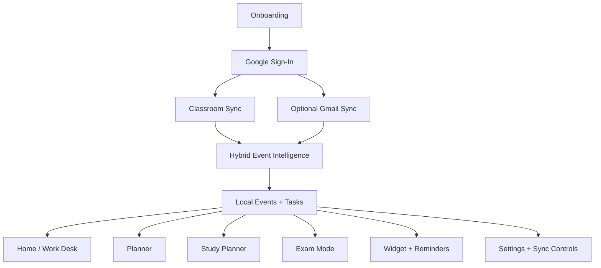
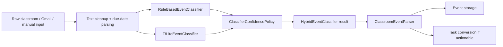
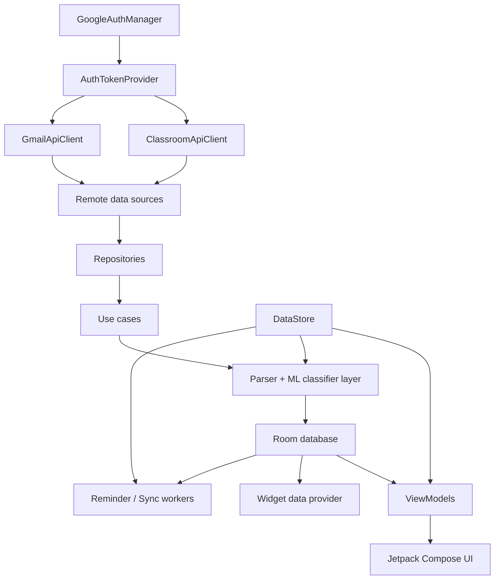

# ClassSync

ClassSync is a local-first Android productivity app for students who want their academic work in one place. It combines Google Classroom sync, optional Gmail-based academic discovery, manual task capture, planner views, exam preparation, study planning, reminders, and a homescreen widget into a single Compose-based experience.

## Try The App

ClassSync is currently available as an Android-only application. Cross-platform support is planned for a later release.

- Closed testing: [Join the Android test](https://play.google.com/apps/testing/com.rochiee.classsync)
- Download: [Get ClassSync on Google Play](https://play.google.com/store/apps/details?id=com.rochiee.classsync)

The current app direction is centered around a hybrid event intelligence pipeline:

- hard rules stay in place for trusted academic signals
- an optional TensorFlow Lite classifier adds smarter classification on top
- the app falls back safely when the model is unavailable or not confident enough

## What The App Does Now

- Syncs Google Classroom coursework, announcements, and materials into local event/task flows
- Supports optional Gmail sync for academic email-derived updates
- Lets users add and manage manual tasks alongside synced work
- Shows work through a dashboard, tasks page, planner, study planner, exam mode, and settings
- Schedules reminders and widget refreshes from locally stored academic state
- Runs a hybrid classifier that decides whether an update is a task, announcement, material, exam/test notice, submission instruction, grade/feedback update, or unknown
- Works without a custom backend; app state is stored locally with Room and DataStore

## Product Snapshot



## Hybrid Intelligence Approach

ClassSync now uses a two-layer classification system instead of relying only on keyword rules.

1. `RuleBasedEventClassifier` runs first for deterministic academic signals.
2. `TfLiteEventClassifier` runs when enabled and the on-device model is available.
3. `HybridEventClassifier` applies confidence policy to decide which result to trust.
4. Trusted hard-rule categories still win when they should.
5. If model loading or inference fails, the app automatically continues with the rule-based path.

### Trusted Hard-Rule Categories

- `DUE_DATE_TASK`
- `TEST_OR_EXAM_INFO`
- `SUBMISSION_INSTRUCTION`

### TFLite-Assisted Categories

- `ACTIONABLE_NO_DATE`
- `ANNOUNCEMENT_ONLY`
- `INFORMATION_ONLY`
- `MATERIAL_ONLY`
- `GRADE_OR_FEEDBACK`
- `UNKNOWN` disambiguation

## Classification Flow



## Architecture



## Main User Surfaces

- `Onboarding`
  - branded full-screen onboarding
  - Google sign-in
  - Classroom and optional Gmail setup
- `Home / Work Desk`
  - quick status, synced work summary, and focus blocks
- `Tasks`
  - manual and synced academic tasks together
  - completion state, removal, and cleanup flow
- `Planner`
  - today, week, month, and range views over academic work
- `Classroom`
  - semester/section-oriented academic data flow and schedule direction
- `Study Planner`
  - generated study blocks with saved progress
- `Exam Mode`
  - checklist-oriented exam preparation
- `Settings`
  - sync controls, theme, reminder lead time, digest, and app behavior
- `Widget`
  - compact academic overview on the homescreen

## ML Training Package

The repository includes a local training workflow in [`ml_training/`](ml_training):

- [`ml_training/train_event_classifier.py`](ml_training/train_event_classifier.py)
- [`ml_training/evaluate_event_classifier.py`](ml_training/evaluate_event_classifier.py)
- [`ml_training/export_tflite.py`](ml_training/export_tflite.py)
- [`ml_training/requirements.txt`](ml_training/requirements.txt)
- [`ml_training/README.md`](ml_training/README.md)

The model is trained on the uploaded synthetic academic event dataset to predict:

- `TASK_REQUIRED`
- `DUE_DATE_TASK`
- `ACTIONABLE_NO_DATE`
- `INFORMATION_ONLY`
- `ANNOUNCEMENT_ONLY`
- `MATERIAL_ONLY`
- `TEST_OR_EXAM_INFO`
- `SUBMISSION_INSTRUCTION`
- `GRADE_OR_FEEDBACK`
- `UNKNOWN`

### Exported App Assets

- [`app/src/main/assets/classsync_event_classifier.tflite`](app/src/main/assets/classsync_event_classifier.tflite)
- [`app/src/main/assets/classsync_event_labels.txt`](app/src/main/assets/classsync_event_labels.txt)

### Model Integration Files

- [`TfLiteEventClassifier.kt`](app/src/main/java/com/rochiee/classsync/ml/classifier/TfLiteEventClassifier.kt)
- [`HybridEventClassifier.kt`](app/src/main/java/com/rochiee/classsync/ml/classifier/HybridEventClassifier.kt)
- [`ClassifierConfidencePolicy.kt`](app/src/main/java/com/rochiee/classsync/ml/classifier/ClassifierConfidencePolicy.kt)
- [`RuleBasedEventClassifier.kt`](app/src/main/java/com/rochiee/classsync/ml/classifier/RuleBasedEventClassifier.kt)
- [`ClassificationMapper.kt`](app/src/main/java/com/rochiee/classsync/ml/classifier/ClassificationMapper.kt)
- [`ClassroomEventParser.kt`](app/src/main/java/com/rochiee/classsync/eventengine/ClassroomEventParser.kt)

## Current Tech Stack

- Kotlin
- Jetpack Compose
- Room
- DataStore
- WorkManager
- Google Classroom API
- Gmail API
- TensorFlow Lite

## Project Structure

```text
app/src/main/java/com/rochiee/classsync
├── ai
├── auth
├── bloc
├── dashboard
├── data
│   ├── local
│   ├── remote
│   └── repository
├── di
├── digest
├── domain
├── eventengine
├── exam
├── export
├── ml
│   └── classifier
├── planner
├── reminder
├── study
├── taskengine
├── ui
├── widget
└── worker
```

## Local Setup

1. Open the project in Android Studio.
2. Use a recent Android SDK and a physical device or emulator.
3. Configure Google OAuth locally.
4. Build and run the app.

### Google OAuth Setup

ClassSync does not require committed secrets in the repo.

Use one of these local-only options:

- `local.properties`
  - `CLASSSYNC_GOOGLE_WEB_CLIENT_ID=...apps.googleusercontent.com`
- `local.properties`
  - `CLASSSYNC_GOOGLE_CLIENT_SECRET_JSON=/absolute/path/to/client_secret_....json`
- shell environment
  - `export CLASSSYNC_GOOGLE_WEB_CLIENT_ID=...apps.googleusercontent.com`

Detailed setup guide:

- [GOOGLE_SETUP.md](docs/GOOGLE_SETUP.md)

## Build And Verify

```bash
./gradlew assembleDebug
./gradlew :app:compileDebugKotlin
./gradlew :app:testDebugUnitTest
```
