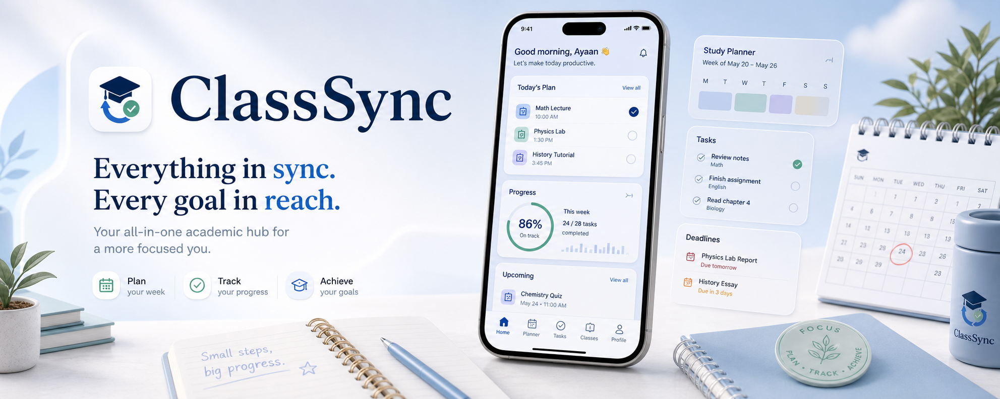
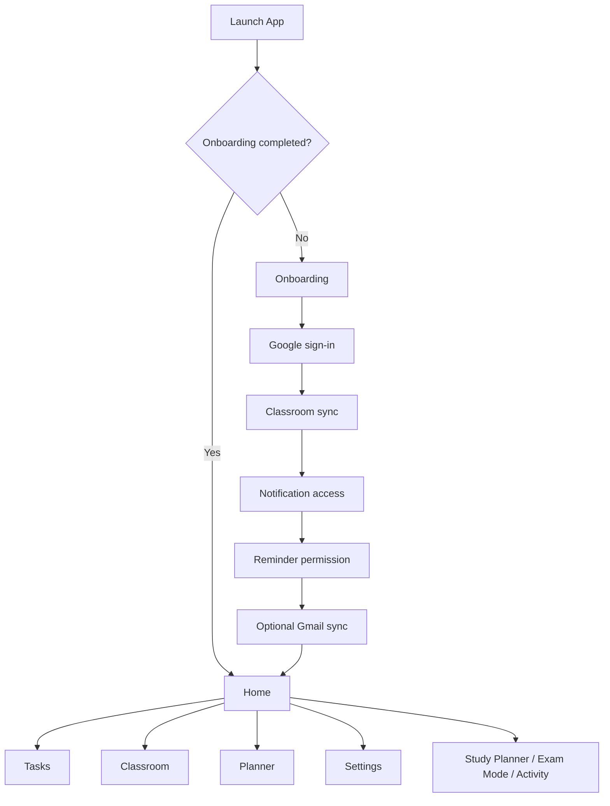
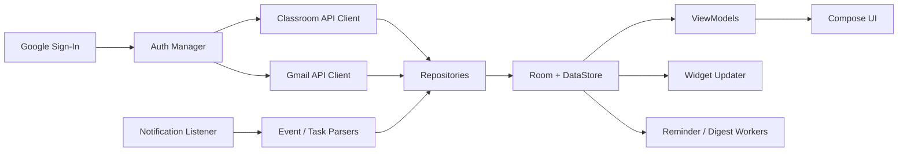

# ClassSync

ClassSync is a local-first Android academic dashboard that brings Google Classroom, optional Gmail reminder discovery, manual tasks, planner views, exam prep, reminders, and a widget into one student-focused workflow.

## Highlights

- Full-screen onboarding with custom branded artwork
- Google sign-in for Classroom and optional Gmail sync
- Task management with completion tracking and deadline tone logic
- Planner modes for today, week, month, and custom range
- Study planner and exam mode workflows
- Activity/event timeline built from Classroom, Gmail, and notification-derived signals
- Reminders, digest support, and homescreen widget surfaces
- Light and dark theming with custom iconography and launcher branding

## Tech Stack

- Kotlin
- Jetpack Compose
- Room
- DataStore
- WorkManager
- Google Classroom API
- Gmail API
- Android notification listener

## App Flow



## Data Architecture



## Navigation Map

- `Onboarding`
- `Home`
- `Tasks`
- `Classroom`
- `Planner`
- `Settings`
- `Auth`
- `Activity`
- `Event Detail`
- `Study Planner`
- `Exam Mode`
- `Debug`

## Project Structure

```text
app/src/main/java/com/rochiee/classsync
├── auth
├── bloc
├── data
│   ├── local
│   ├── remote
│   ├── notification
│   └── repository
├── di
├── domain
├── digest
├── eventengine
├── exam
├── planner
├── reminder
├── taskengine
├── ui
├── widget
└── worker
```

## Local Setup

1. Open the project in Android Studio.
2. Ensure a recent Android SDK and emulator/device are available.
3. Configure Google OAuth locally.
4. Build and run the debug app.

### Google OAuth Setup

ClassSync does not require committed secrets in the repo.

Use one of these local-only options:

- `local.properties`
  - `CLASSSYNC_GOOGLE_WEB_CLIENT_ID=...apps.googleusercontent.com`
- `local.properties`
  - `CLASSSYNC_GOOGLE_CLIENT_SECRET_JSON=/absolute/path/to/client_secret_....json`
- shell environment
  - `export CLASSSYNC_GOOGLE_WEB_CLIENT_ID=...apps.googleusercontent.com`

Detailed instructions:

- [`docs/GOOGLE_SETUP.md`](docs/GOOGLE_SETUP.md)

## Build

```bash
./gradlew assembleDebug
```

## Current Notes

- Google sign-in is local-project dependent.
  - If sign-in fails, check the Android OAuth client package name plus SHA-1 and SHA-256 fingerprints.
- Gmail sync is intentionally optional.
- The app is local-first and does not depend on a custom backend service.

## Contributor Notes

- Use `AGENT.md` for repo workflow guidance.
- Do not add milestone output dump files again.
- Keep secrets out of versioned resources and committed markdown.
