# 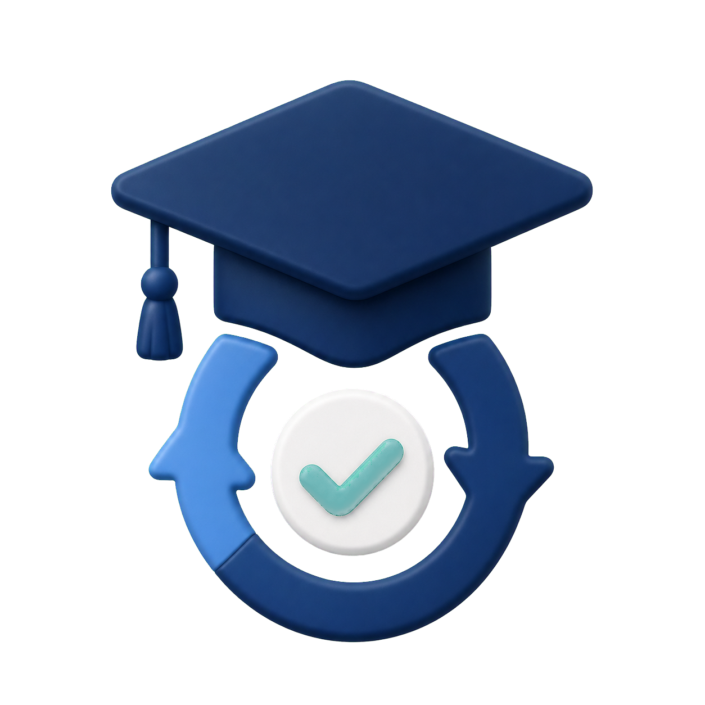

# User manual

This document is the end-user guide and system blueprint for ClassSync. It explains:

- how the app starts
- how login works
- how Google Classroom and Gmail are connected
- how data travels from Google APIs into the local database
- how tasks, events, reminders, widgets, and planner views are generated
- which files and components own each step

If you want the short product overview, see [README.md](../README.md).  
If you want Google OAuth setup details, see [GOOGLE_SETUP.md](./GOOGLE_SETUP.md).

---

## 1. Product Purpose

ClassSync is a local-first Android academic workspace. Its job is to unify:

- Google Classroom course data
- optional Gmail academic reminder emails
- manual user-created tasks
- planner and study flows
- reminders and widget summaries

The app does not rely on a custom backend. The core runtime model is:

1. sign in with Google
2. read Classroom and optional Gmail data
3. parse that data into local academic events
4. convert actionable events into local tasks
5. show those tasks everywhere in the UI
6. keep reminders, widgets, and planner views in sync with that local state

---

## 2. Top-Level Blueprint

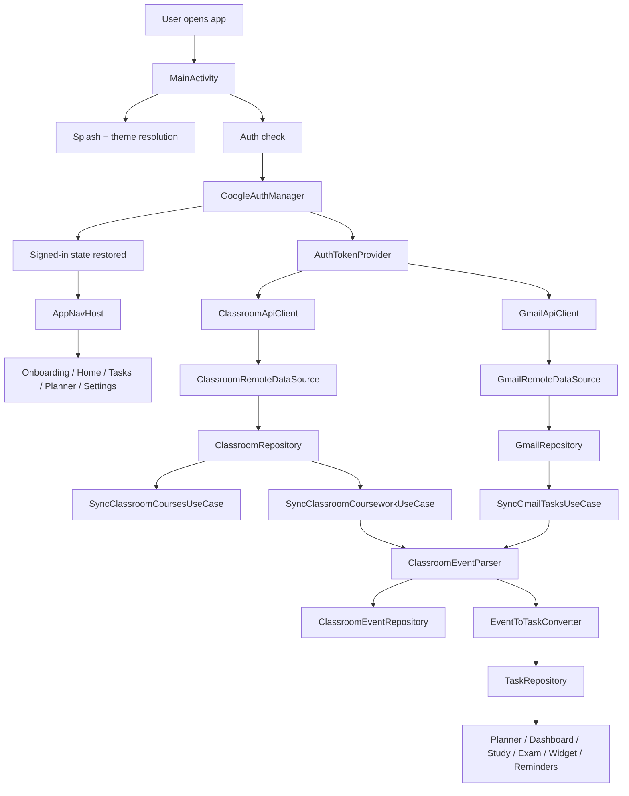

---

## 3. Runtime Entry Point

### Main application class

- File: [ClassSyncApplication.kt](/Users/rohanc/AndroidStudioProjects/classsync/app/src/main/java/com/rochiee/classsync/ClassSyncApplication.kt)
- Purpose:
  Creates the dependency container once for the process.

### Main activity

- File: [MainActivity.kt](/Users/rohanc/AndroidStudioProjects/classsync/app/src/main/java/com/rochiee/classsync/MainActivity.kt)
- Responsibilities:
  - installs Android splash handling
  - initializes all major view models
  - triggers `AuthEvent.CheckAuthState`
  - loads theme preferences
  - shows the custom animated welcome screen
  - starts auto-refresh sync when the user is signed in and launch splash ends

### App launch sequence

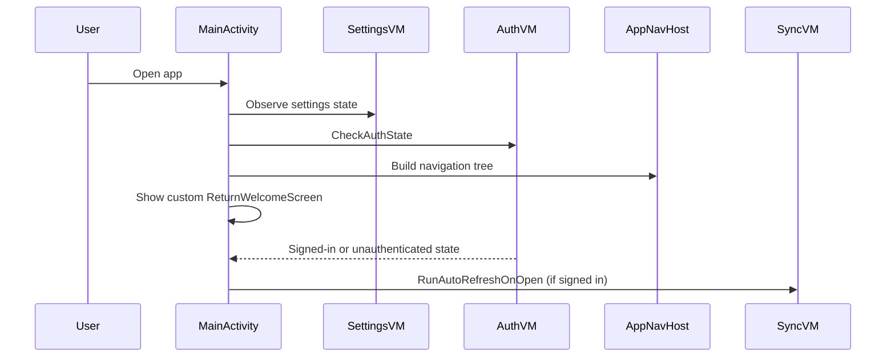

---

## 4. Dependency Injection Blueprint

### Container

- File: [AppContainer.kt](/Users/rohanc/AndroidStudioProjects/classsync/app/src/main/java/com/rochiee/classsync/di/AppContainer.kt)
- Pattern:
  A manual service locator / dependency container based on lazy properties.

### What the container wires

- Local persistence
  - Room database
  - DataStore settings
  - task suppression storage
- Auth
  - `GoogleAuthManager`
  - `AuthTokenProvider`
- Remote APIs
  - `ClassroomApiClient`
  - `GmailApiClient`
- Remote data sources
  - `ClassroomRemoteDataSource`
  - `GmailRemoteDataSource`
- Repositories
  - task
  - classroom
  - classroom event
  - Gmail
  - sync logs
  - settings
- Domain services
  - `ClassroomEventParser`
  - `EventToTaskConverter`
  - dashboard / planner / study / exam aggregators
  - widget provider helpers
  - digest scheduler
  - reminder scheduler
- Use cases
  - sync
  - export
  - planner
  - reminders
  - settings
  - study and exam tools

### Container relationship map

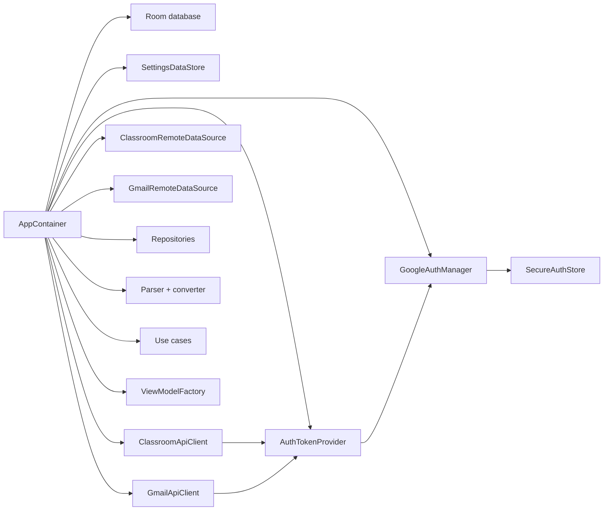

---

## 5. Login Flow Blueprint

### Main login components

- [GoogleAuthManager.kt](/Users/rohanc/AndroidStudioProjects/classsync/app/src/main/java/com/rochiee/classsync/auth/GoogleAuthManager.kt)
- [AuthTokenProvider.kt](/Users/rohanc/AndroidStudioProjects/classsync/app/src/main/java/com/rochiee/classsync/auth/AuthTokenProvider.kt)
- [SecureAuthStore.kt](/Users/rohanc/AndroidStudioProjects/classsync/app/src/main/java/com/rochiee/classsync/auth/SecureAuthStore.kt)
- [AuthBlocViewModel.kt](/Users/rohanc/AndroidStudioProjects/classsync/app/src/main/java/com/rochiee/classsync/bloc/auth/AuthBlocViewModel.kt)
- [AuthScreen.kt](/Users/rohanc/AndroidStudioProjects/classsync/app/src/main/java/com/rochiee/classsync/ui/screens/auth/AuthScreen.kt)
- [OnboardingScreen.kt](/Users/rohanc/AndroidStudioProjects/classsync/app/src/main/java/com/rochiee/classsync/ui/screens/onboarding/OnboardingScreen.kt)

### What login is for

Login gives the app two things:

1. a selected Google identity
2. OAuth consent for the Classroom and Gmail read scopes

The app does not run its own auth server. It relies on Google sign-in and Google API credentials bound to the signed-in account email.

### Login flow step by step

1. The user taps the Google connect action from onboarding or auth.
2. `GoogleAuthManager.beginSignInIntent(...)` checks whether `BuildConfig.GOOGLE_WEB_CLIENT_ID` is configured.
3. If configured, it builds `GoogleSignInOptions`:
   - `requestEmail()`
   - `requestIdToken(webClientId)`
   - `requestScopes(...)` for all configured Google scopes
4. Android launches the Google sign-in UI.
5. When the sign-in result returns, `GoogleAuthManager.completeSignIn(...)` reads the result from `GoogleSignIn.getSignedInAccountFromIntent(...)`.
6. On success, `persistAccount(...)` stores:
   - email
   - display name
   in `SecureAuthStore`.
7. `AuthState.Authenticated` is emitted to the UI layer.
8. `AuthTokenProvider` later uses the selected email to build a `GoogleAccountCredential` for API calls.

### Login flow diagram

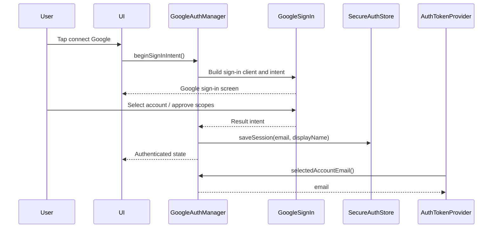

### Session persistence

`SecureAuthStore` uses `EncryptedSharedPreferences` when available and stores:

- `google_account_email`
- `google_account_display_name`

This allows the app to restore a lightweight signed-in identity across launches even before a fresh API call is made.

### OAuth configuration expectations

The app expects:

- a valid Google web client ID in build config
- an Android OAuth client with the correct package name and SHA fingerprints
- enabled Classroom and Gmail APIs

Reference:
- [GOOGLE_SETUP.md](./GOOGLE_SETUP.md)

---

## 6. Google API Scope Model

### Scope source

- File: [GoogleScopes.kt](/Users/rohanc/AndroidStudioProjects/classsync/app/src/main/java/com/rochiee/classsync/auth/GoogleScopes.kt)

### Purpose

Scopes define what the app can read.

ClassSync uses read-oriented scopes for:

- Classroom courses
- Classroom coursework
- Classroom announcements
- Classroom materials
- Gmail read-only access

The app is not designed to write back to Gmail or Google Classroom.

---

## 7. Google API Credential Flow

### Credential bridge

- File: [AuthTokenProvider.kt](/Users/rohanc/AndroidStudioProjects/classsync/app/src/main/java/com/rochiee/classsync/auth/AuthTokenProvider.kt)

### What it does

`AuthTokenProvider` converts the selected signed-in email into a `GoogleAccountCredential`.

That credential is reused by:

- `ClassroomApiClient`
- `GmailApiClient`

### Credential path

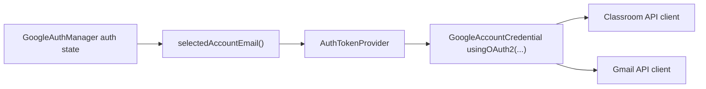

---

## 8. Classroom API Flow

### Files involved

- [ClassroomApiClient.kt](/Users/rohanc/AndroidStudioProjects/classsync/app/src/main/java/com/rochiee/classsync/data/remote/classroom/ClassroomApiClient.kt)
- [ClassroomRemoteDataSource.kt](/Users/rohanc/AndroidStudioProjects/classsync/app/src/main/java/com/rochiee/classsync/data/remote/classroom/ClassroomRemoteDataSource.kt)
- [ClassroomRepositoryImpl.kt](/Users/rohanc/AndroidStudioProjects/classsync/app/src/main/java/com/rochiee/classsync/data/repository/ClassroomRepositoryImpl.kt)
- [SyncClassroomCoursesUseCase.kt](/Users/rohanc/AndroidStudioProjects/classsync/app/src/main/java/com/rochiee/classsync/domain/usecase/classroom/SyncClassroomCoursesUseCase.kt)
- [SyncClassroomCourseworkUseCase.kt](/Users/rohanc/AndroidStudioProjects/classsync/app/src/main/java/com/rochiee/classsync/domain/usecase/classroom/SyncClassroomCourseworkUseCase.kt)

### API client responsibilities

`ClassroomApiClient`:

- creates a Google Classroom service using the signed-in credential
- fetches:
  - courses
  - coursework
  - announcements
  - materials
  - submissions
- turns API failures into user-facing `IllegalStateException` messages using `ClassroomErrorInterpreter`

### Remote data source responsibilities

`ClassroomRemoteDataSource`:

- maps raw Google API models into app DTOs
- normalizes timestamps
- flattens attachments and alternate links
- converts due dates into epoch milliseconds

### Repository responsibilities

`ClassroomRepositoryImpl`:

- exposes remote fetch methods
- stores local courses in Room through `CourseDao`
- exposes locally saved courses as reactive flows

### Classroom sync pipeline

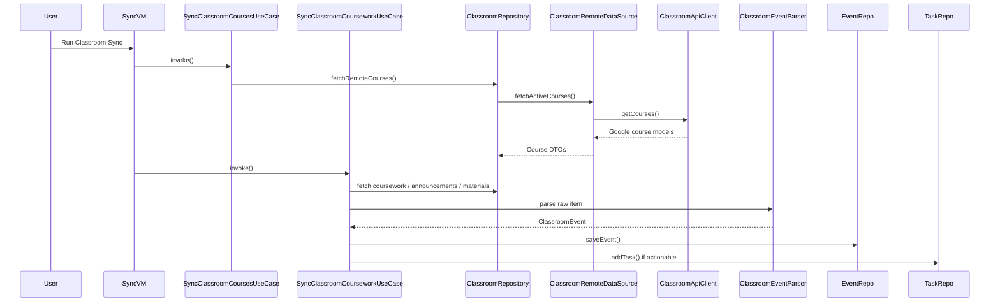

### What gets imported from Classroom

- active courses
- coursework
- announcements
- materials
- optionally submission and grade-related information where available

### Local results of Classroom sync

Classroom sync produces:

- local course records
- local classroom event records
- local tasks generated from actionable events
- sync logs
- refreshed widget state

---

## 9. Gmail API Flow

### Files involved

- [GmailApiClient.kt](/Users/rohanc/AndroidStudioProjects/classsync/app/src/main/java/com/rochiee/classsync/data/remote/gmail/GmailApiClient.kt)
- [GmailRemoteDataSource.kt](/Users/rohanc/AndroidStudioProjects/classsync/app/src/main/java/com/rochiee/classsync/data/remote/gmail/GmailRemoteDataSource.kt)
- [GmailClassroomEmailParser.kt](/Users/rohanc/AndroidStudioProjects/classsync/app/src/main/java/com/rochiee/classsync/data/remote/gmail/GmailClassroomEmailParser.kt)
- [GmailRepositoryImpl.kt](/Users/rohanc/AndroidStudioProjects/classsync/app/src/main/java/com/rochiee/classsync/data/repository/GmailRepositoryImpl.kt)
- [SyncGmailTasksUseCase.kt](/Users/rohanc/AndroidStudioProjects/classsync/app/src/main/java/com/rochiee/classsync/domain/usecase/gmail/SyncGmailTasksUseCase.kt)

### API client responsibilities

`GmailApiClient`:

- creates a Google Gmail service from the signed-in credential
- searches the inbox using an academic-oriented query
- fetches full message details for candidate messages

### Remote data source responsibilities

`GmailRemoteDataSource`:

- filters recent academic/Classroom-oriented messages
- extracts:
  - message id
  - thread id
  - subject
  - sender
  - snippet
  - body
  - internal date
  - Gmail link

### Gmail body interpretation

`GmailClassroomEmailParser`:

- reads the body shape of Classroom notification emails
- extracts:
  - course name
  - item title
  - detail link
  - stable source ID
- resolves trusted Classroom detail links from supported Google redirect chains

### Gmail sync pipeline

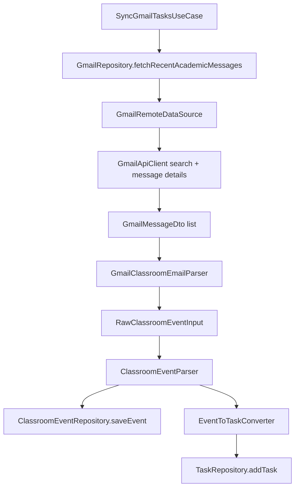

### Important Gmail design rule

Gmail is optional and secondary.  
ClassSync uses Gmail mostly to detect academic reminders and Classroom notification emails, not as the primary academic source of truth.

---

## 10. Event Parsing and Task Conversion

### Files involved

- [ClassroomEventParser.kt](/Users/rohanc/AndroidStudioProjects/classsync/app/src/main/java/com/rochiee/classsync/eventengine/ClassroomEventParser.kt)
- [ClassroomEventClassifier.kt](/Users/rohanc/AndroidStudioProjects/classsync/app/src/main/java/com/rochiee/classsync/eventengine/ClassroomEventClassifier.kt)
- [RuleBasedEventClassifier.kt](/Users/rohanc/AndroidStudioProjects/classsync/app/src/main/java/com/rochiee/classsync/ml/classifier/RuleBasedEventClassifier.kt)
- [HybridEventClassifier.kt](/Users/rohanc/AndroidStudioProjects/classsync/app/src/main/java/com/rochiee/classsync/ml/classifier/HybridEventClassifier.kt)
- [TfLiteEventClassifier.kt](/Users/rohanc/AndroidStudioProjects/classsync/app/src/main/java/com/rochiee/classsync/ml/classifier/TfLiteEventClassifier.kt)
- [EventToTaskConverter.kt](/Users/rohanc/AndroidStudioProjects/classsync/app/src/main/java/com/rochiee/classsync/eventengine/EventToTaskConverter.kt)

### Parser responsibilities

`ClassroomEventParser`:

- normalizes title and body text
- derives due dates
- builds a stable event fingerprint
- asks the classifier layer to determine event and action type
- outputs a `ClassroomEvent`

### Converter responsibilities

`EventToTaskConverter`:

- decides whether an event is actionable
- maps it into a local `AcademicTask`
- carries safe source links when allowed

### Task generation blueprint

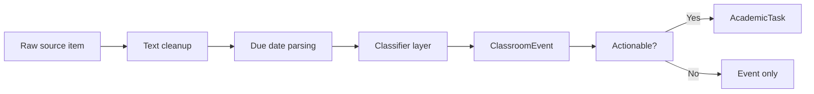

---

## 11. Local Storage Blueprint

### Room database

- File: [ClassSyncDatabase.kt](/Users/rohanc/AndroidStudioProjects/classsync/app/src/main/java/com/rochiee/classsync/data/local/database/ClassSyncDatabase.kt)

### Main Room entities

- tasks
- courses
- sync logs
- classroom events

### Main repositories

- [TaskRepositoryImpl.kt](/Users/rohanc/AndroidStudioProjects/classsync/app/src/main/java/com/rochiee/classsync/data/repository/TaskRepositoryImpl.kt)
- [ClassroomEventRepositoryImpl.kt](/Users/rohanc/AndroidStudioProjects/classsync/app/src/main/java/com/rochiee/classsync/data/repository/ClassroomEventRepositoryImpl.kt)
- [ClassroomRepositoryImpl.kt](/Users/rohanc/AndroidStudioProjects/classsync/app/src/main/java/com/rochiee/classsync/data/repository/ClassroomRepositoryImpl.kt)
- [SyncLogRepositoryImpl.kt](/Users/rohanc/AndroidStudioProjects/classsync/app/src/main/java/com/rochiee/classsync/data/repository/SyncLogRepositoryImpl.kt)

### What each local store holds

- Tasks:
  The actionable workload shown in Tasks, Planner, Home, reminders, and widget.
- Classroom events:
  The broader imported event timeline, including items that are not tasks.
- Courses:
  The imported course list used by the Classroom area.
- Sync logs:
  Human-readable records of sync successes, warnings, skips, and failures.

---

## 12. Preference Storage Blueprint

### Settings store

- File: [SettingsDataStore.kt](/Users/rohanc/AndroidStudioProjects/classsync/app/src/main/java/com/rochiee/classsync/data/local/preferences/SettingsDataStore.kt)

### What it stores

- background sync toggle
- Gmail sync toggle
- Classroom sync toggle
- smart classification toggle
- TensorFlow Lite classification toggle
- reminder lead hours
- onboarding completion
- digest settings
- theme mode
- last sync time
- last app open time
- persisted study plan JSON
- persisted exam checklist JSON

### Suppression store

- File: [TaskSuppressionStore.kt](/Users/rohanc/AndroidStudioProjects/classsync/app/src/main/java/com/rochiee/classsync/data/local/preferences/TaskSuppressionStore.kt)

### Purpose

When a synced task is completed and removed by the user, suppression keys help prevent the same remote task from immediately reappearing as a duplicate after the next sync.

---

## 13. Task Repository Behavior

### File

- [TaskRepositoryImpl.kt](/Users/rohanc/AndroidStudioProjects/classsync/app/src/main/java/com/rochiee/classsync/data/repository/TaskRepositoryImpl.kt)

### Core responsibilities

- inserts new tasks
- updates existing tasks
- deletes tasks
- applies recency rules
- checks suppression rules
- merges duplicates
- schedules or cancels reminders
- refreshes widget state
- refreshes due-soon notifications

### Duplicate handling

The task repository uses:

- `DuplicateTaskDetector`
- `TaskRecencyPolicy`
- suppression keys

to keep Classroom, Gmail, and manual flows from flooding the user with repeated tasks.

---

## 14. Reminder System Blueprint

### Files involved

- [ReminderScheduler.kt](/Users/rohanc/AndroidStudioProjects/classsync/app/src/main/java/com/rochiee/classsync/reminder/ReminderScheduler.kt)
- [TaskReminderReceiver.kt](/Users/rohanc/AndroidStudioProjects/classsync/app/src/main/java/com/rochiee/classsync/reminder/TaskReminderReceiver.kt)
- [ReminderNotificationHelper.kt](/Users/rohanc/AndroidStudioProjects/classsync/app/src/main/java/com/rochiee/classsync/reminder/ReminderNotificationHelper.kt)
- [DueSoonNotificationHelper.kt](/Users/rohanc/AndroidStudioProjects/classsync/app/src/main/java/com/rochiee/classsync/reminder/DueSoonNotificationHelper.kt)

### How reminders work

1. A task is created or updated.
2. The task repository asks `ReminderScheduler` to schedule it.
3. `ReminderScheduler` subtracts the configured lead hours from the due date.
4. It creates a broadcast `PendingIntent` for `TaskReminderReceiver`.
5. At trigger time, `TaskReminderReceiver` builds a reminder notification.

### Reminder flow

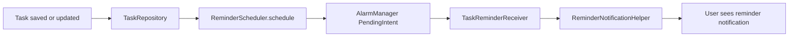

---

## 15. Background Sync and Worker Blueprint

### Files involved

- [WorkScheduler.kt](/Users/rohanc/AndroidStudioProjects/classsync/app/src/main/java/com/rochiee/classsync/worker/WorkScheduler.kt)
- [GmailSyncWorker.kt](/Users/rohanc/AndroidStudioProjects/classsync/app/src/main/java/com/rochiee/classsync/worker/GmailSyncWorker.kt)
- [ClassroomSyncWorker.kt](/Users/rohanc/AndroidStudioProjects/classsync/app/src/main/java/com/rochiee/classsync/worker/ClassroomSyncWorker.kt)
- [FullSyncWorker.kt](/Users/rohanc/AndroidStudioProjects/classsync/app/src/main/java/com/rochiee/classsync/worker/FullSyncWorker.kt)
- [WidgetRefreshWorker.kt](/Users/rohanc/AndroidStudioProjects/classsync/app/src/main/java/com/rochiee/classsync/worker/WidgetRefreshWorker.kt)
- [DueSoonNotificationWorker.kt](/Users/rohanc/AndroidStudioProjects/classsync/app/src/main/java/com/rochiee/classsync/worker/DueSoonNotificationWorker.kt)

### Worker types

- Gmail sync worker
- Classroom sync worker
- full sync worker
- widget refresh worker
- due-soon notification refresh worker

### Scheduling policy

- periodic Gmail sync every 12 hours
- periodic Classroom sync every 12 hours
- periodic full sync every 12 hours
- widget refresh every hour
- due-soon refresh every hour
- one-time full sync support

### Background work map

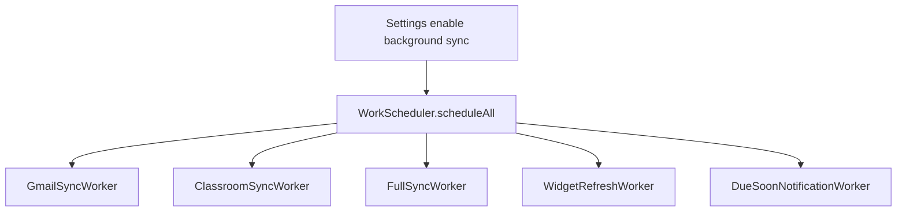

---

## 16. Widget Blueprint

### Files involved

- [WidgetDataProvider.kt](/Users/rohanc/AndroidStudioProjects/classsync/app/src/main/java/com/rochiee/classsync/widget/WidgetDataProvider.kt)
- [ClassSyncWidgetUpdater.kt](/Users/rohanc/AndroidStudioProjects/classsync/app/src/main/java/com/rochiee/classsync/widget/ClassSyncWidgetUpdater.kt)
- [ClassSyncWidgetProvider.kt](/Users/rohanc/AndroidStudioProjects/classsync/app/src/main/java/com/rochiee/classsync/widget/ClassSyncWidgetProvider.kt)
- [WidgetTaskFormatter.kt](/Users/rohanc/AndroidStudioProjects/classsync/app/src/main/java/com/rochiee/classsync/widget/WidgetTaskFormatter.kt)

### Widget responsibilities

The widget:

- reads open task state from the local task repository
- calculates:
  - today count
  - urgent count
  - overdue count
  - primary focus task
- renders that state into Android `RemoteViews`
- opens the app to Home or Tasks when tapped

---

## 17. Navigation and Screen Blueprint

### Navigation source

- File: [AppDestination.kt](/Users/rohanc/AndroidStudioProjects/classsync/app/src/main/java/com/rochiee/classsync/ui/navigation/AppDestination.kt)
- File: [AppNavHost.kt](/Users/rohanc/AndroidStudioProjects/classsync/app/src/main/java/com/rochiee/classsync/ui/navigation/AppNavHost.kt)

### Main destinations

- onboarding
- home
- tasks
- classroom
- planner
- settings
- debug
- auth
- activity
- event detail
- study planner
- exam mode

### Bottom bar destinations

- home
- tasks
- planner
- settings

### Screen ownership by view model

- Auth:
  `AuthBlocViewModel`
- Tasks:
  `TaskBlocViewModel`
- Sync:
  `SyncBlocViewModel`
- Settings:
  `SettingsBlocViewModel`
- Events:
  `EventBlocViewModel`
- Planner:
  `PlannerBlocViewModel`
- Classroom:
  `ClassroomScreenViewModel`
- Event detail:
  `EventDetailViewModel`
- Study plan:
  `StudyPlanBlocViewModel`
- Exam mode:
  `ExamModeBlocViewModel`

---

## 18. User-Facing Screen Responsibilities

### Onboarding

- introduces the app
- gathers auth and permissions
- prepares the user for sync setup

### Auth

- shows Google sign-in state
- lets the user connect or disconnect

### Home

- shows summary and high-level academic workload

### Tasks

- task list
- manual task creation
- task completion
- redirect to source when available
- export support through the task view model

### Planner

- today, week, month, and range planning views

### Classroom

- academic catalog and imported course views

### Study Planner

- generated study plan workflow

### Exam Mode

- focused exam-prep and checklist surfaces

### Settings

- sync controls
- auth status
- theme settings
- digest settings
- reminder lead time
- diagnostics and manual sync actions

---

## 19. End-to-End API-to-UI Construction Flow

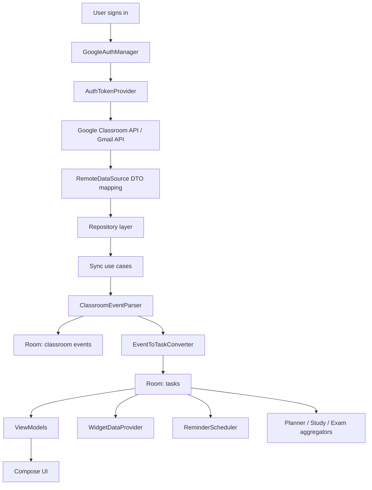

---

## 20. Data Ownership Summary

### Google owns

- account identity
- Classroom raw data
- Gmail raw message data

### ClassSync owns locally

- parsed academic events
- local tasks
- sync logs
- user settings
- study plan state
- exam checklist state
- reminder schedules
- widget summary state derived from tasks

### The user controls

- whether Gmail sync is enabled
- whether Classroom sync is enabled
- whether background sync is enabled
- reminder lead time
- theme mode
- manual tasks
- completion state

---

## 21. Troubleshooting by Pipeline Stage

### A. Login problems

Check:

- web client ID exists in build config
- Android OAuth package name matches `com.rochiee.classsync`
- SHA-1 and SHA-256 fingerprints are registered
- the correct Google account is used

### B. Classroom sync problems

Check:

- Classroom sync is enabled in Settings
- the account can open Google Classroom
- the account actually belongs to the class context you expect

### C. Gmail sync problems

Check:

- Gmail sync is enabled
- Gmail permission was granted during sign-in
- the target messages match the academic search patterns

### D. Missing tasks

Check:

- whether the item was parsed as an informational event instead of an actionable task
- whether the task was suppressed after prior completion/removal
- whether due dates or text content made the item non-actionable

### E. Widget or reminder problems

Check:

- task due dates exist
- reminders are enabled by notification permissions
- background restrictions are not blocking workers or alarms

---

## 22. File Index for Blueprint Readers

### App bootstrap

- [MainActivity.kt](/Users/rohanc/AndroidStudioProjects/classsync/app/src/main/java/com/rochiee/classsync/MainActivity.kt)
- [ClassSyncApplication.kt](/Users/rohanc/AndroidStudioProjects/classsync/app/src/main/java/com/rochiee/classsync/ClassSyncApplication.kt)

### Auth

- [GoogleAuthManager.kt](/Users/rohanc/AndroidStudioProjects/classsync/app/src/main/java/com/rochiee/classsync/auth/GoogleAuthManager.kt)
- [AuthTokenProvider.kt](/Users/rohanc/AndroidStudioProjects/classsync/app/src/main/java/com/rochiee/classsync/auth/AuthTokenProvider.kt)
- [SecureAuthStore.kt](/Users/rohanc/AndroidStudioProjects/classsync/app/src/main/java/com/rochiee/classsync/auth/SecureAuthStore.kt)

### Remote APIs

- [ClassroomApiClient.kt](/Users/rohanc/AndroidStudioProjects/classsync/app/src/main/java/com/rochiee/classsync/data/remote/classroom/ClassroomApiClient.kt)
- [GmailApiClient.kt](/Users/rohanc/AndroidStudioProjects/classsync/app/src/main/java/com/rochiee/classsync/data/remote/gmail/GmailApiClient.kt)

### Sync pipeline

- [SyncClassroomCourseworkUseCase.kt](/Users/rohanc/AndroidStudioProjects/classsync/app/src/main/java/com/rochiee/classsync/domain/usecase/classroom/SyncClassroomCourseworkUseCase.kt)
- [SyncGmailTasksUseCase.kt](/Users/rohanc/AndroidStudioProjects/classsync/app/src/main/java/com/rochiee/classsync/domain/usecase/gmail/SyncGmailTasksUseCase.kt)
- [ClassroomEventParser.kt](/Users/rohanc/AndroidStudioProjects/classsync/app/src/main/java/com/rochiee/classsync/eventengine/ClassroomEventParser.kt)
- [EventToTaskConverter.kt](/Users/rohanc/AndroidStudioProjects/classsync/app/src/main/java/com/rochiee/classsync/eventengine/EventToTaskConverter.kt)

### Persistence

- [ClassSyncDatabase.kt](/Users/rohanc/AndroidStudioProjects/classsync/app/src/main/java/com/rochiee/classsync/data/local/database/ClassSyncDatabase.kt)
- [TaskRepositoryImpl.kt](/Users/rohanc/AndroidStudioProjects/classsync/app/src/main/java/com/rochiee/classsync/data/repository/TaskRepositoryImpl.kt)
- [ClassroomEventRepositoryImpl.kt](/Users/rohanc/AndroidStudioProjects/classsync/app/src/main/java/com/rochiee/classsync/data/repository/ClassroomEventRepositoryImpl.kt)
- [SettingsDataStore.kt](/Users/rohanc/AndroidStudioProjects/classsync/app/src/main/java/com/rochiee/classsync/data/local/preferences/SettingsDataStore.kt)

### Background systems

- [WorkScheduler.kt](/Users/rohanc/AndroidStudioProjects/classsync/app/src/main/java/com/rochiee/classsync/worker/WorkScheduler.kt)
- [ReminderScheduler.kt](/Users/rohanc/AndroidStudioProjects/classsync/app/src/main/java/com/rochiee/classsync/reminder/ReminderScheduler.kt)
- [ClassSyncWidgetUpdater.kt](/Users/rohanc/AndroidStudioProjects/classsync/app/src/main/java/com/rochiee/classsync/widget/ClassSyncWidgetUpdater.kt)

---

## 23. Closing Summary

ClassSync is built as a local-first pipeline:

1. authenticate with Google
2. create API credentials from the selected account
3. fetch Classroom and optional Gmail data
4. normalize and classify imported items
5. store events and tasks locally
6. drive every major screen, reminder, and widget from that local model

That design is why the app can feel unified even though the inputs come from multiple Google surfaces.
