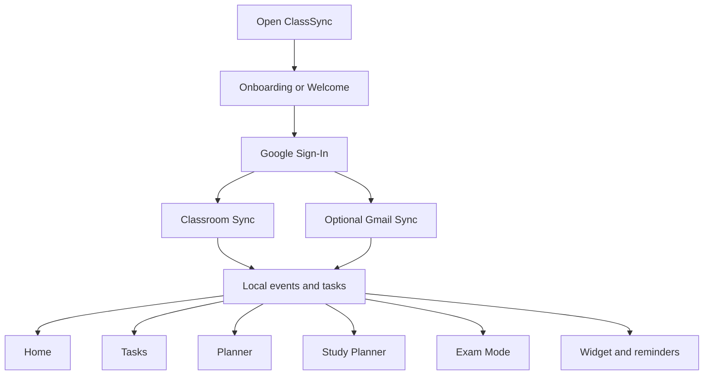
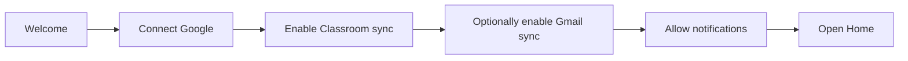
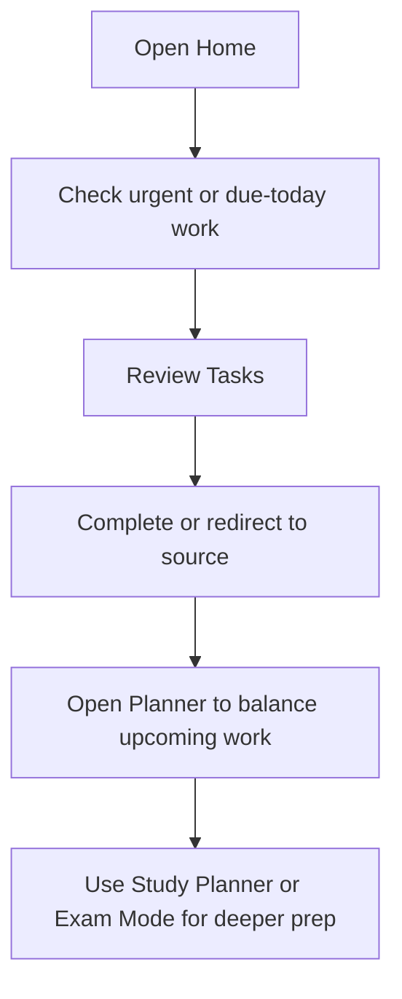
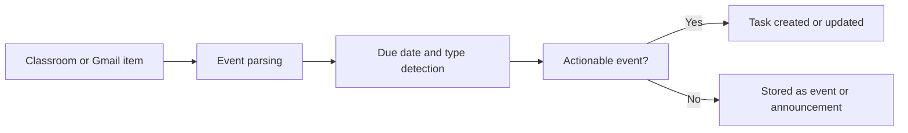

# 

# User manual

ClassSync is a local-first academic workspace for students who want assignments, reminders, schedules, study planning, and exam prep in one place.

## What ClassSync Does

- Brings together Google Classroom coursework, optional Gmail reminders, and manual tasks.
- Organizes work across Home, Tasks, Planner, Study Planner, Exam Mode, and Settings.
- Stores your working data on-device so you can keep using the app without a separate backend.
- Supports reminders, sync controls, and a homescreen widget for quick visibility.

## App Overview

## First-Time Setup

### 1. Start the app

- Open ClassSync.
- Move through the onboarding screens.
- Tap the Google connect step when you are ready to link your account.

### 2. Connect your Google account

- Sign in with the Google account that has access to your classes.
- If your Classroom data belongs to a school-managed account, use that same school account in ClassSync.
- If sign-in fails, check the setup guide in [GOOGLE_SETUP.md](./GOOGLE_SETUP.md).

### 3. Choose your sync sources

- Classroom sync:
  Imports courses, coursework, announcements, and materials.
- Gmail sync:
  Optional. Used to detect academic reminders and Classroom notification emails.

### 4. Allow notifications

- Enable app notifications if you want reminders.
- If you use notification-based features later, grant the requested Android permissions when prompted.

## Onboarding Flow

## Main Screens

## Home

- Shows your current academic summary.
- Helps you see what needs attention first.
- Useful when you want a quick check-in without opening every section.

## Tasks

- Contains synced and manual tasks together.
- Lets you mark work complete or undo completion.
- Shows due dates, course labels, posted timestamps, and task priority.
- If a task comes from a supported source, the `Redirect` action opens the related academic page.

## Planner

- Offers today, week, month, and range views.
- Helps you see workload distribution over time.
- Useful for spotting deadline clusters and planning ahead.

## Classroom

- Displays course and schedule-oriented academic information.
- Helps you browse imported academic structure and related items.

## Study Planner

- Turns your current academic state into a study plan.
- Lets you keep track of study items and progress.

## Exam Mode

- Focuses on exam preparation items and checklist-style review.
- Useful near tests, vivas, and submission-heavy periods.

## Settings

- Controls Gmail sync, Classroom sync, background sync, reminders, digest behavior, and theme.
- Includes sync actions so you can manually trigger refreshes.
- Includes auth and diagnostics support when needed.

## Daily Workflow

## Sync Behavior

### Classroom sync

- Imports academic items from Google Classroom.
- Converts actionable coursework into tasks when appropriate.
- Keeps task and event information aligned with the latest imported course data.

### Gmail sync

- Looks for recent academic emails, especially Classroom-related notifications.
- Uses the body of supported Classroom emails to identify the course and item more reliably.
- Avoids duplicate tasks when multiple related Classroom emails point to the same academic item.

### Background sync

- Can be enabled from Settings.
- Uses Android background work to refresh data periodically.
- Manual sync remains available if you want an immediate update.

## How Task Creation Works

## Reminders and Widget

### Reminders

- Reminders are based on due dates and your configured lead time.
- You can change the default reminder window in Settings.
- Due-soon notifications help surface urgent work automatically.

### Homescreen widget

- Shows a compact academic summary.
- Highlights today, urgent, and overdue counts.
- Displays a primary focus task when one is available.

## Manual Task Entry

- Open the Tasks screen.
- Add a title, course, and optional notes.
- Choose a due date if needed.
- Save the task to keep it alongside synced academic work.

## Troubleshooting

### Google sign-in works but no classes appear

- Make sure the signed-in account is the same one you use in Google Classroom.
- Open `classroom.google.com` with that account to confirm the classes are visible there.
- If this is a school account, the Workspace admin may need to allow access.

### Gmail sync shows little or nothing

- Gmail sync is optional and only looks for academic mail patterns.
- Make sure Gmail sync is enabled in Settings.
- Run `Sync Gmail` manually from Settings after connecting your account.

### Duplicate tasks

- ClassSync tries to merge matching Classroom and Gmail items when they refer to the same academic source.
- If you still see unexpected duplicates, run a fresh sync and review whether the items came from different sources or truly separate assignments.

### Reminders are missing

- Confirm notification permission is granted.
- Check the task due date and your reminder lead time in Settings.
- Make sure background sync and notifications are not heavily restricted by the device.

### Widget is not updating

- Open the app once to refresh local state.
- Trigger a manual sync from Settings.
- Re-add the widget if Android has stopped updating it properly.

## Privacy and Safety Notes

- ClassSync is local-first.
- The app stores working academic data on-device.
- Gmail sync is read-only and optional.
- Classroom sync is read-only.
- External academic links are opened only when they pass app safety checks.

## Tips for Best Results

- Use the same Google account across Classroom and Gmail for the cleanest sync results.
- Add due dates to manual tasks so reminders and planner views work better.
- Use Planner for workload balancing and Study Planner for focused prep.
- Review Settings after setup so reminder timing and background sync match your routine.

## Quick Reference

| Area | Best For |
|---|---|
| Home | Fast overview |
| Tasks | Action and completion |
| Planner | Deadline layout |
| Classroom | Course context |
| Study Planner | Guided study sessions |
| Exam Mode | Assessment prep |
| Settings | Sync and behavior control |

## Support Files

- Setup guide: [GOOGLE_SETUP.md](./GOOGLE_SETUP.md)
- Project overview: [README.md](../README.md)
- Contributor notes: [AGENT.md](../AGENT.md)
